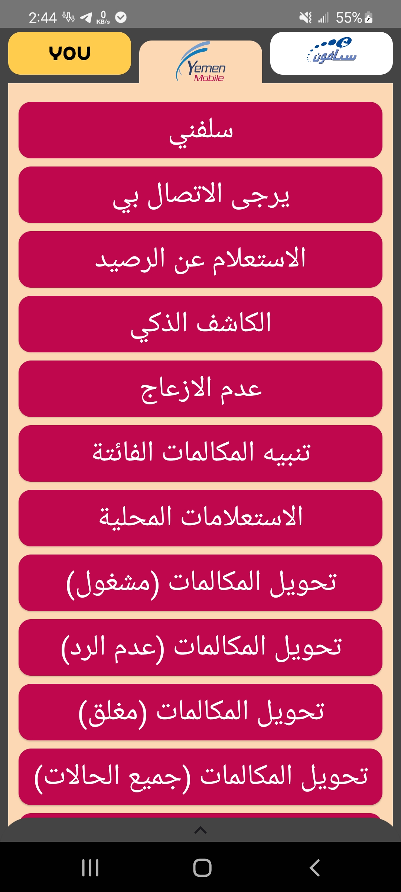
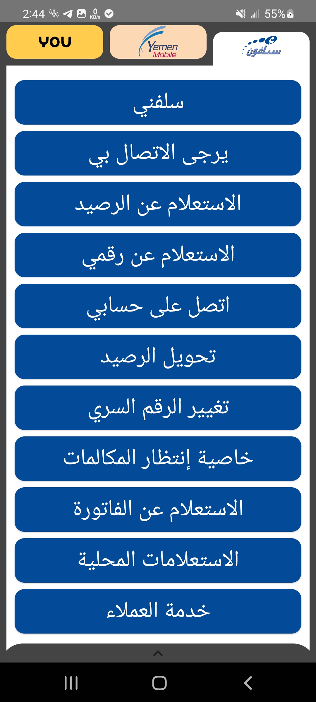
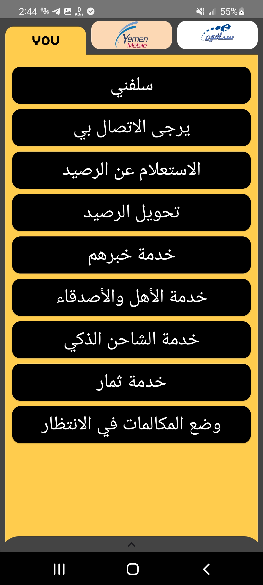
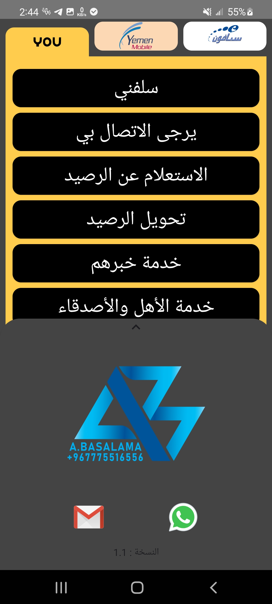
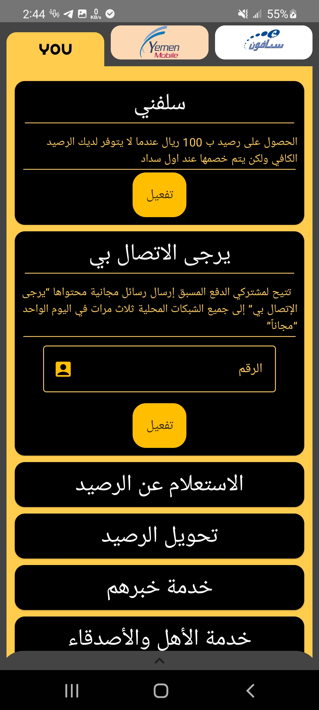
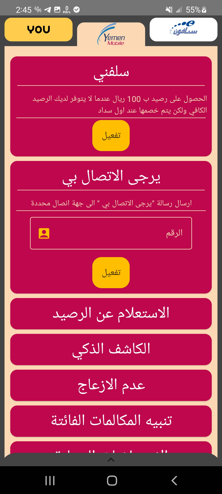
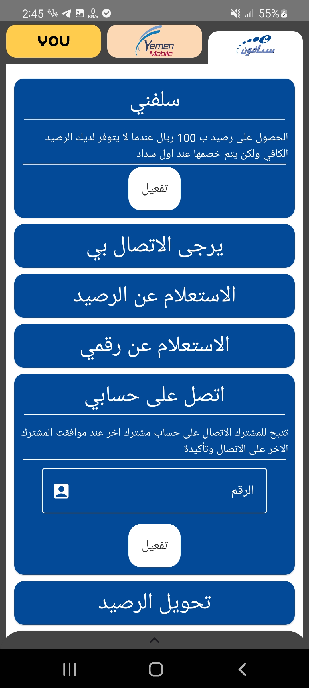

# كود فون

👍 تفعيل الخدمات لشبكات الاتصال اليمنية بطريقة سهلة وتلقائية دون الحاجة لحفظ رموزها

تريد استخدام خدمة سلفني او يرجى الاتصال بي لأحد اصدقائك او كنت مشغولاً وتريد تحويل المكالمات له او لا تريد ان يزعجك احد بالإتصالات في وقت راحتك 😅

.كل هذا ولكن للاسف لا تعرف رموز واكواد تلك الخدمات 😥

لا تقلق🤗

فقد وفرنا لك تطبيق يسهل لك الوصول لهذه الخدمات بل وأكثر 😆
وبضغطة زر تملك السيطرة على الخدمات من تفعيل وإلغاء👍😏

💠تطبيق كود فون💠

اصبح متاحا الان📢

ومجاناً😁

## رابط التحميل

[تحميل](https://github.com/1basalama/myApps/raw/main/CodePhone.apk)

## الميزات

- واجهة مميزة وسهلة الوصول لجميع الخدمات بسرعة.
- امكانية تفعيل الخدمات بالاتصال او برسالة SMS بشكل تلقائي وسهل.
- امكانية استخدام جهات الاتصال في اكواد الخدمات بشكل الي وسريع 

## صور الشاشة

<table>
  <tr>
    <td>
      
       
      <em></em>
    </td>
    <td>
      
       
      <em></em>
    </td>
  </tr>
  <tr>
    <td>
      
       
      <em></em>
    </td>
    <td>
      
       
      <em></em>
    </td>
  </tr>
  <tr>
    <td>
      
       
      <em></em>
    </td>
    <td>
      
       
      <em></em>
    </td>
  </tr>
  <tr>
    <td>
      
       
      <em></em>
    </td>
    
  </tr>
</table>

##تواصل معنا

نحن نرحب بملاحظاتك ومساهماتك لتحسين تطبيق كود فون. إذا واجهت أي مشاكل أو لديك اقتراحات لميزات جديدة، يُرجى لتواصل معنا على [واتساب](https://wa.me/+967775516556). نقدر دعمك في تحسين هذا التطبيق لصالح المجتمع.

